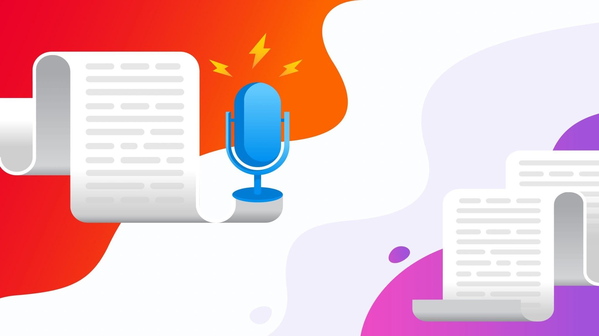

# Audio Transcription Web App


## Introduction
This is a Django web app built using the Speech Recognition Module API. The app comes with an easy to use UI where you can upload English audio file and it will be converted into text.

## Features
<ul>
    <li>Accurate transcription</li>
    <li>Beautiful UI to interact with the app</li>
    <li>Upload your own files</li>
</ul>

## Setup
Setup everything using the requirements.txt file. 
Just run ``` python3 -r requirements.txt ```

## Usage
If you have everything installed you just need to run:
``` python3 manage.py runserver ```  
Then all you need is to open 127.0.0.1:8000 and interact with the app.